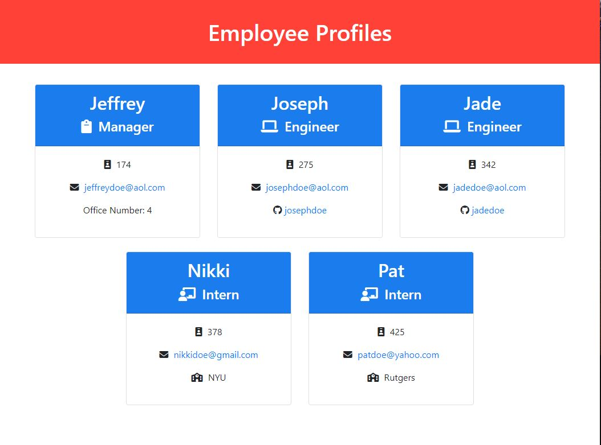

# Company Accounts Page Generator

## Description:
As a Company Leader or CEO, have you ever wanted to create an Employee Info Page through an inquirer prompt? JThe Company Accounts Page Generator will do just that ! Follow the prompt after the inital command and you'll have a newly created Employee Info Page in no time!

## Table of Contents:
* [Technologies](#technologies)
* [Screenshot](#screenshot)
* [Installation](#installation)
* [Usage](#usage)
* [Author(s)](#authors)
* [Contact Info](#contact-info)

## Technologies:
* HTML
* CSS
* Bootstrap
* JavaScript
* JQuery
* Node.js (npm)
* Inquirer
* Jest

## Screenshot:
Outcome:

;

Example Video:
;

## Installation:
`npm init`

`npm install inquirer`

`npm install jest --save-dev`

## Usage:
Clone this repository onto your local machine from GitHub. Open and make sure you are in the appropriate terminal/working directory. Run the [Installation](#installation) commands. Once downloaded run the prompt questionnaire with `node index.js`. Answer the following prompts and your newly created `index.html` will be located in the /dist directory.

## Author(s):
* Jeffrey Young

## Contact Info:
Jeffrey Young: https://github.com/jeffymiyoung

---
© 2022 Company Accounts Page Generator

